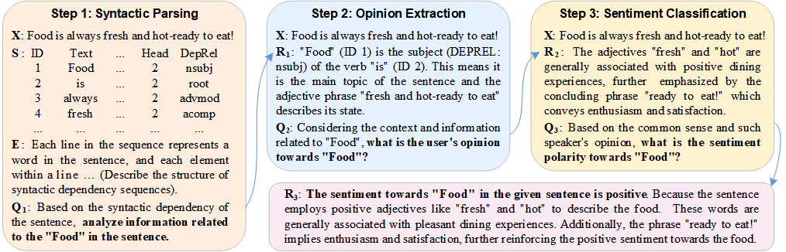

# Syn-Chain-ABSA
Aspect-Based Sentiment Analysis with Syntax-Opinion-Sentiment Reasoning Chain (Coling 2025).

----------

## Overview

<p align="center">
  
</p>

## Citation

If you use this project in your research, please cite our paper:


**BibTeX:**

```bibtex
@inproceedings{fan2025aspect,
  author       = {Rui Fan and
                  Shu Li and
                  Tingting He and
                  Yu Liu},
  title        = {Aspect-Based Sentiment Analysis with Syntax-Opinion-Sentiment Reasoning
                  Chain},
  booktitle    = {Proceedings of the 31st International Conference on Computational
                  Linguistics, {COLING} 2025, Abu Dhabi, UAE, January 19-24, 2025},
  pages        = {3123--3137},
  publisher    = {Association for Computational Linguistics},
  year         = {2025},
  url          = {https://aclanthology.org/2025.coling-main.210/},
}

